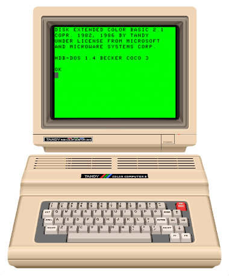

# CoCoVM

CoCoVM is a desktop emulator for the Tandy Color Computer 1, 2, and 3. It
combines a Rust emulation core with an [egui](https://github.com/emilk/egui)
virtual machine manager for running and organizing multiple CoCo systems.



CoCoVM is under active development and hasn't reached version 1.0. Save-state
compatibility can change between releases. See the [changelog](CHANGELOG.md) for
release details and known limitations.

## Features

- CoCo 1, CoCo 2, and CoCo 3 models with model-specific memory and video
  options
- MC6847 and GIME video with RGB, composite monitor, color TV, and black-and-white
  TV presentation
- Keyboard, mouse, and gamepad input, including standard and high-resolution
  joystick interfaces
- Cassette, floppy disk, virtual hard disk (VHD), cartridge, Multi-Pak, and
  DriveWire support
- Emulated printers, serial hardware, real-time clock, Orchestra-90, and
  Sound/Speech Cartridge
- Multiple named virtual machines with pause, suspend, resume, and save-state
  support
- A built-in Model Context Protocol (MCP) server for local automation

## Download CoCoVM

Download a prebuilt archive from the
[latest GitHub release](https://github.com/sperano/cocovm/releases/latest).
Release builds target these platforms:

- macOS 11 or later on Apple silicon and Intel
- Linux on 64-bit Arm and x86-64
- Windows on x86-64

The source repository doesn't contain copyrighted ROM images. On first launch,
CoCoVM lists any missing runtime assets and asks before downloading the separate
asset bundle. On Linux and macOS, CoCoVM installs these files under
`~/.local/share/cocovm/assets/`. ROM images remain copyrighted by their
respective owners and aren't covered by the source-code licenses in this
repository. See [NOTICE.md](NOTICE.md) for details.

## Build from source

Install the [latest stable Rust toolchain](https://www.rust-lang.org/tools/install).

On Debian or Ubuntu, install the native development libraries:

```sh
sudo apt-get install \
  libasound2-dev \
  libudev-dev \
  libxkbcommon-dev \
  libwayland-dev \
  libxcb-render0-dev \
  libxcb-shape0-dev \
  libxcb-xfixes0-dev
```

Then clone and run CoCoVM:

```sh
git clone https://github.com/sperano/cocovm.git
cd cocovm
cargo run -p coco-egui
```

For an optimized build, add `--release` to the `cargo run` command.

## Configure CoCoVM

The manager's settings dialog covers the global application settings. CoCoVM
also creates a commented `config.toml` template on first launch at these paths:

- Linux and macOS: `~/.config/cocovm/config.toml`
- Windows: `%APPDATA%\spe\cocovm\config.toml`

Each setting can come from a command-line flag, an environment variable, or the
configuration file. A flag takes precedence over an environment variable, which
takes precedence over the file. Run `cocovm --help` for the complete command-line
reference.

The most important settings are:

| Purpose | Flag | Environment variable | Default |
|---|---|---|---|
| Log level | `--log-level` | `COCOVM_LOG_LEVEL` | `warn` |
| MCP server port | `--control-port` | `COCOVM_CONTROL_PORT` | `6809` |
| Asset bundle URL | `--assets-url` | `COCOVM_ASSETS_URL` | Built-in bundle |
| Icon-only toolbars | `--toolbar-icons-only` | `COCOVM_TOOLBAR_ICONS_ONLY` | `false` |
| Icon-only status bar | `--status-bar-icons-only` | `COCOVM_STATUS_BAR_ICONS_ONLY` | `false` |

Set the control port to `0` to disable the MCP server.

To change a hotkey, open the settings dialog, click the hotkey's current key,
and then press the new key. The rebindable hotkeys are the key layout window
(F10), the keyboard mode toggle (F12), New machine (Cmd+N on macOS, Ctrl+N
elsewhere), and, in builds with the `debug-ui` feature, the debugger (Cmd+D or
Ctrl+D). Hotkeys have no flag or environment variable. In `config.toml`, they're
the `hotkey_*` keys, and the template describes their syntax.

## Control a VM with MCP

CoCoVM serves an MCP endpoint at `http://127.0.0.1:6809/mcp` by default. The
listener accepts local connections only, and it runs inside the application.

To register the endpoint with Claude Code, run:

```sh
claude mcp add --transport http cocovm http://127.0.0.1:6809/mcp
```

The server provides tools to list and start virtual machines, read text or a PNG
from the display, type text, enter a BASIC listing, press keys, move joysticks,
manage disks, reset or pause a machine, wait for video fields or matching screen
text, and read or write memory. Screen matching accepts a literal string or
regular expression. Call `tools/list` through an MCP client for the complete
schemas.

The `enter_basic` tool types a multi-line BASIC listing one line at a time and
stops at the first line that BASIC answers with an error, such as `?SN ERROR`.
It checks the whole listing before it types anything: a listing can have up to
8,192 characters, a line can have up to 249 characters, and every character
must exist on the CoCo keyboard. Typing takes about 0.1 seconds per character,
so a long listing can take several minutes.

Clients that negotiate MCP protocol version 2025-06-18 also receive structured
results: `list_vms`, `screen_text`, `enter_basic`, `wait_for_text`, and `peek`
declare an output schema and return JSON alongside their text. Clients on
earlier protocol versions receive the text only.

## Develop CoCoVM

Run the workspace checks before submitting a change:

```sh
cargo test --workspace
cargo clippy --workspace --all-targets
cargo fmt --all -- --check
```

Some integration tests use installed ROMs or disk images from a separate test
asset bundle. Many skip when their required assets aren't available, but the
CoCo 3 boot smoke tests require `coco3.rom`. Set `COCOVM_TEST_ASSETS_URL` to an
empty value to prevent the test bundle download.

The workspace contains these main components:

| Path | Purpose |
|---|---|
| `crates/mc6809` | Reusable MC6809 CPU core |
| `crates/tms7000` | Reusable TMS7000 CPU core used by the Sound/Speech Cartridge |
| `crates/coco-core` | Headless machine, devices, media, audio, and video |
| `crates/coco-egui` | Desktop frontend and virtual machine manager |
| `crates/test-assets` | Test asset discovery and download support |
| `book` | A 16-chapter course based on the emulator |

For more detail, read the [course outline](book/README.md), the
[performance guide](performance/README.md), and the [changelog](CHANGELOG.md).

## License

Licensing differs by crate:

- `coco-core` and `coco-egui` use GPL-3.0-or-later.
- `mc6809` uses MIT OR Apache-2.0.
- `tms7000` uses (MIT OR Apache-2.0) AND BSD-3-Clause.
- `cocovm-test-assets` uses MIT OR Apache-2.0.

See [LICENSE](LICENSE) and [NOTICE.md](NOTICE.md) for the full terms,
third-party attributions, and bundled-material details.
