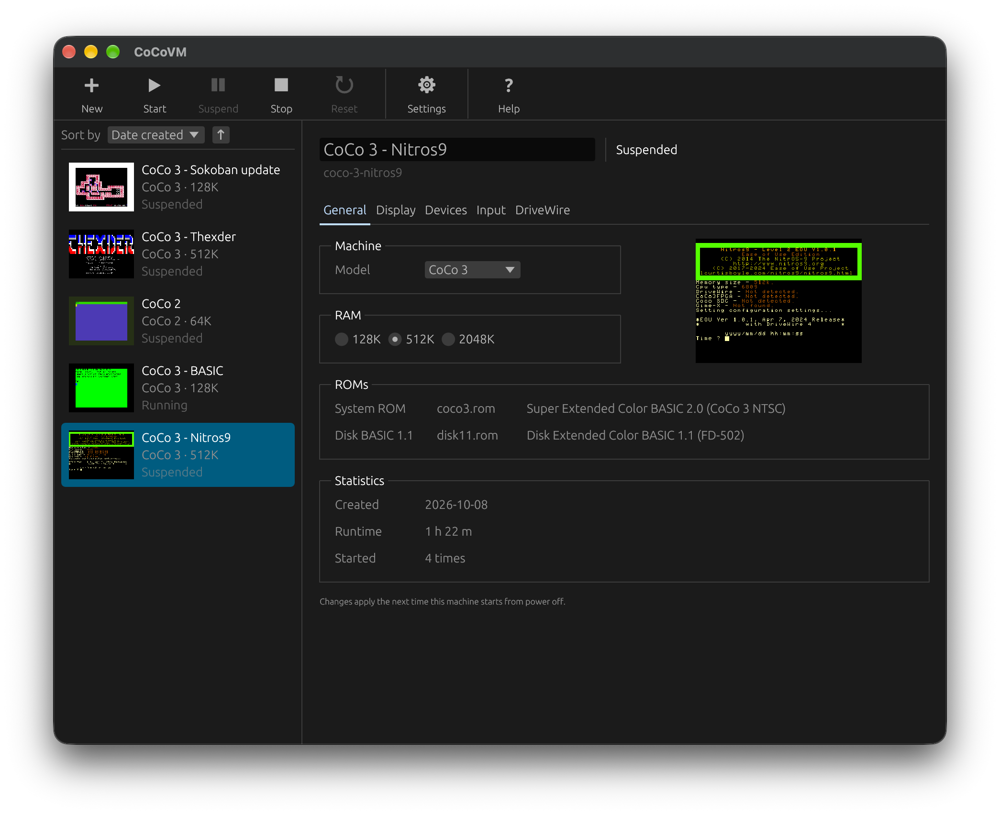
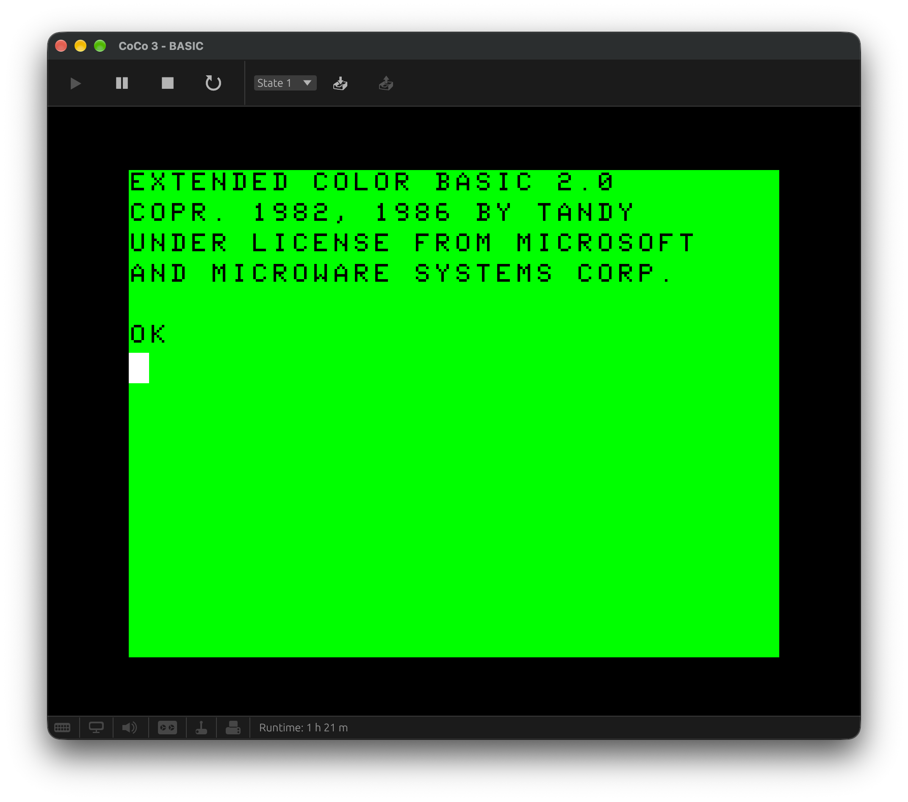
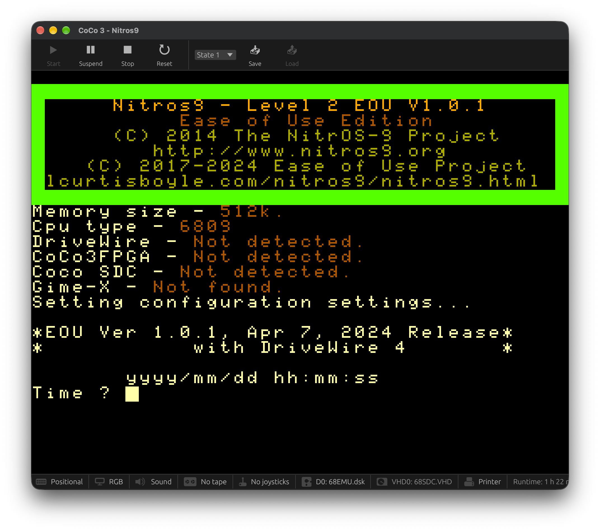
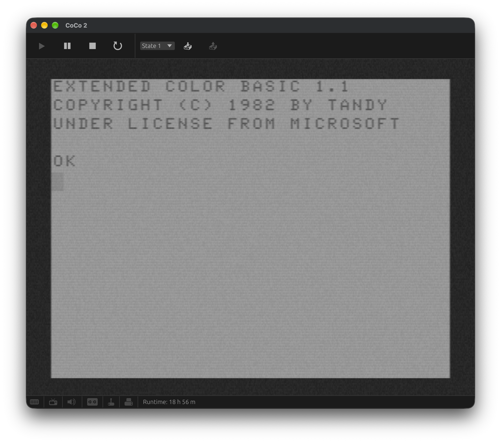

# CoCoVM

CoCoVM is a desktop emulator for the Tandy Color Computer 1, 2, and 3. It
combines a Rust emulation core with an [egui](https://github.com/emilk/egui)
virtual machine manager for running and organizing multiple CoCo systems.

CoCoVM is under active development and hasn't reached version 1.0. Save-state
compatibility can change between releases. See the [changelog](CHANGELOG.md) for
release details and known limitations.

Only the Motorola 6809 CPU is emulated for now. Support for the Hitachi 6309 is
coming soon, as is a debugger in release builds (an early version exists behind
the `debug-ui` build feature).

## Screenshots

<table>
  <tr>
    <td></td>
    <td></td>
  </tr>
  <tr>
    <td></td>
    <td></td>
  </tr>
</table>

## Features

- CoCo 1, CoCo 2, and CoCo 3 models with model-specific memory and video
  options
- MC6847 and GIME video with RGB, composite monitor, color TV, and black-and-white
  TV presentation
- Keyboard, mouse, and gamepad input, including standard and high-resolution
  joystick interfaces
- Cassette, floppy disk, virtual hard disk (VHD), cartridge, Multi-Pak, and
  DriveWire support
- Emulated printers, serial hardware, real-time clock, Orchestra-90, and
  Sound/Speech Cartridge
- Multiple named virtual machines with pause, suspend, resume, and save-state
  support
- A built-in Model Context Protocol (MCP) server for local automation

## Download CoCoVM

Download a prebuilt archive from the
[latest GitHub release](https://github.com/sperano/cocovm/releases/latest).
Release builds target these platforms:

- macOS 11 or later on Apple silicon and Intel
- Linux on 64-bit Arm and x86-64
- Windows on x86-64

The macOS download is a signed `cocovm.app`. The Linux archive includes an
`install.sh` that installs the binary, a desktop entry and the icon under
`~/.local` (pass another prefix, such as `/usr/local`, as its argument). The
Windows executable runs from any folder.

The source repository doesn't contain copyrighted ROM images. On first launch,
CoCoVM lists any missing runtime assets and asks before downloading the separate
asset bundle. On Linux and macOS, CoCoVM installs these files under
`~/.local/share/cocovm/assets/`. ROM images remain copyrighted by their
respective owners and aren't covered by the source-code licenses in this
repository. See [NOTICE.md](NOTICE.md) for details.

## Build from source

Install the [latest stable Rust toolchain](https://www.rust-lang.org/tools/install).

On Debian or Ubuntu, install the native development libraries:

```sh
sudo apt-get install \
  libasound2-dev \
  libudev-dev \
  libxkbcommon-dev \
  libwayland-dev \
  libxcb-render0-dev \
  libxcb-shape0-dev \
  libxcb-xfixes0-dev
```

Then clone and run CoCoVM:

```sh
git clone https://github.com/sperano/cocovm.git
cd cocovm
cargo run
```

For an optimized build, add `--release` to the `cargo run` command.

## Launch a saved machine

Run `cocovm` with no arguments to open the manager and choose a machine from the
list. To start a saved machine as the manager opens, pass its slug:

```sh
cocovm my-coco
```

The slug is the stem of the machine's `<slug>.toml` file under the
configuration directory's `machines/` folder; the manager shows it under the
machine's Name field.

## Configure CoCoVM

The manager's settings dialog covers the global application settings. CoCoVM
also creates a commented `config.toml` template on first launch at these paths:

- Linux and macOS: `~/.config/cocovm/config.toml`
- Windows: `%APPDATA%\spe\cocovm\config.toml`

Each setting can come from a command-line flag, an environment variable, or the
configuration file. A flag takes precedence over an environment variable, which
takes precedence over the file. Run `cocovm --help` for the complete command-line
reference.

The most important settings are:

| Purpose | Flag | Environment variable | Default |
|---|---|---|---|
| Log level | `--log-level` | `COCOVM_LOG_LEVEL` | `warn` |
| MCP server port | `--control-port` | `COCOVM_CONTROL_PORT` | `6809` |
| Asset bundle URL | `--assets-url` | `COCOVM_ASSETS_URL` | Built-in bundle |
| Icon-only toolbars | `--toolbar-icons-only` | `COCOVM_TOOLBAR_ICONS_ONLY` | `false` |
| Icon-only status bar | `--status-bar-icons-only` | `COCOVM_STATUS_BAR_ICONS_ONLY` | `false` |

Set the control port to `0` to disable the MCP server.

To change a hotkey, open the settings dialog, click the hotkey's current key,
and then press the new key. The rebindable hotkeys are the key layout window
(F10), the keyboard mode toggle (F12), New machine (Cmd+N on macOS, Ctrl+N
elsewhere), and, in builds with the `debug-ui` feature, the debugger (Cmd+D or
Ctrl+D). Hotkeys have no flag or environment variable. In `config.toml`, they're
the `hotkey_*` keys, and the template describes their syntax.

## Control a VM with MCP

CoCoVM serves an MCP endpoint at `http://127.0.0.1:6809/mcp` by default. The
listener accepts local connections only, and it runs inside the application.

To register the endpoint with Claude Code, run:

```sh
claude mcp add --transport http cocovm http://127.0.0.1:6809/mcp
```

The server provides tools to list, start, stop, and suspend virtual machines,
read text or a PNG from the display, type text, enter a BASIC listing, press
keys, move joysticks, manage disks, reset or pause a machine, wait for video
fields or matching screen text, and read or write memory. The VM list includes
each machine's model, RAM size, CPU, cartridge, and mounted media. Like the
manager's Stop and Suspend buttons, `stop_vm` and `suspend_vm` write modified
floppies and tapes back to their files first. Screen matching accepts a literal
string or regular expression. Memory tools address the CPU's current memory map
by default. With `physical` set, they address installed RAM directly, from
offset 0 to the end of RAM. `peek` returns a hex dump with an ASCII column. Call
`tools/list` through an MCP client for the complete schemas.

The `wait` and `wait_for_text` tools run at real-time speed by default, so a
3,600-field wait takes a minute. Set `fast_forward` to `true` to run the VM as
fast as the host allows until the call returns. Audio is dropped during a
fast-forward, and the emulator still responds to the other windows. A VM can
fast-forward for one call at a time.

The `enter_basic` tool types a multi-line BASIC listing one line at a time and
stops at the first line that BASIC answers with an error, such as `?SN ERROR`.
It checks the whole listing before it types anything: a listing can have up to
8,192 characters, a line can have up to 249 characters, and every character
must exist on the CoCo keyboard. Typing takes about 0.1 seconds per character,
so a long listing can take several minutes.

Clients that negotiate MCP protocol version 2025-06-18 also receive structured
results: `list_vms`, `screen_text`, `enter_basic`, `wait_for_text`, and `peek`
declare an output schema and return JSON alongside their text. Clients on
earlier protocol versions receive the text only.

The server also publishes each VM's screen as MCP resources, so a client can
attach the screen to a prompt without a tool call. `resources/list` reports two
resources per VM: `cocovm://vm/<slug>/screen.txt` is the decoded text screen as
`text/plain`, and `cocovm://vm/<slug>/screen.png` is the framebuffer as
`image/png`. Reading a resource follows the `screen_text` rules: it fails while
the VM is powered off, or suspended with its window closed, until the VM
starts. The server doesn't offer resource subscriptions or list-change
notifications, because it sends no server-to-client stream.

## Develop CoCoVM

Run the workspace checks before submitting a change:

```sh
cargo test --workspace
cargo clippy --workspace --all-targets
cargo fmt --all -- --check
```

Some integration tests use installed ROMs or disk images from a separate test
asset bundle. Many skip when their required assets aren't available, but the
CoCo 3 boot smoke tests require `coco3.rom`. Set `COCOVM_TEST_ASSETS_URL` to an
empty value to prevent the test bundle download.

The workspace contains these main components:

| Path | Purpose |
|---|---|
| `crates/mc6809` | Reusable MC6809 CPU core |
| `crates/tms7000` | Reusable TMS7000 CPU core used by the Sound/Speech Cartridge |
| `crates/coco-core` | Headless machine, devices, media, audio, and video |
| `crates/coco-egui` | Desktop frontend and virtual machine manager |
| `crates/test-assets` | Test asset discovery and download support |

For more detail, read the [performance guide](performance/README.md) and the
[changelog](CHANGELOG.md).

## About this project

The Color Computer 3 was the computer I grew up with, and CoCoVM is my love
letter to it. It isn't the first CoCo emulator, and it doesn't try to replace
the established ones:

- [VCC](https://github.com/VCCE/VCC) — the long-running Windows CoCo 3
  emulator, with [OVCC](https://github.com/WallyZambotti/OVCC) bringing it to
  Linux and macOS
- [XRoar](https://www.6809.org.uk/xroar/) — CoCo 1/2/3 and Dragon, on desktop
  and [in the browser](https://www.6809.org.uk/xroar/online/)
- [MAME](https://www.mamedev.org/) — CoCo 1/2/3 alongside thousands of other
  systems, with a powerful debugger
- [Clock Signal](https://github.com/TomHarte/CLK) — a multi-system emulator
  with CoCo 1/2 support
- [JS Mocha](https://www.haplessgenius.com/mocha/) — a CoCo 2 in the browser

Earlier emulators include Jeff Vavasour's DOS emulators, MESS (now part of
MAME), Virtual CoCo on the classic Mac OS, and CoCoNut on Palm OS.

CoCoVM exists for the fun of building one: a chance to write a cycle-counted
6809 machine in Rust, to see how far AI coding agents (Claude, Codex, and
DeepSeek) can go on a project like this, and to make the result as friendly
as possible. Machines are created and managed from a GUI, missing ROMs are
downloaded on first launch, and everyday use never needs a config file.
Hardware behavior is checked against the original technical manuals, real ROM
images, and trace comparisons with MAME and XRoar rather than taken on faith.

## License

Licensing differs by crate:

- `coco-core` and `coco-egui` use GPL-3.0-or-later.
- `mc6809` uses MIT OR Apache-2.0.
- `tms7000` uses (MIT OR Apache-2.0) AND BSD-3-Clause.
- `cocovm-test-assets` uses MIT OR Apache-2.0.

See [LICENSE](LICENSE) and [NOTICE.md](NOTICE.md) for the full terms,
third-party attributions, and bundled-material details.
