# mc6809 crate — flow charts & sequence diagrams

## Flow Charts

### 1. `MC6809::step()` — main dispatch loop

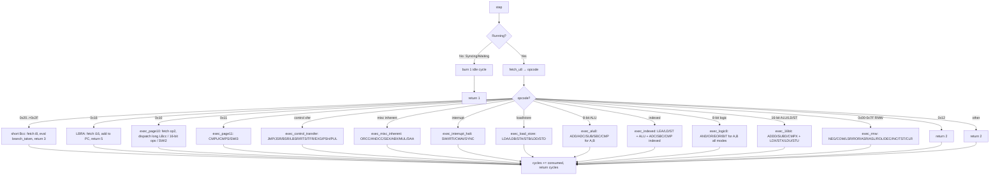

### 2. Indexed Addressing: `ea_indexed()`

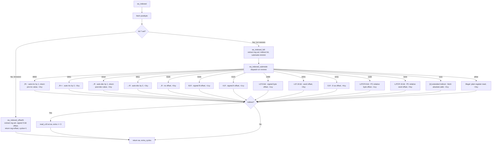

### 3. Interrupt Delivery

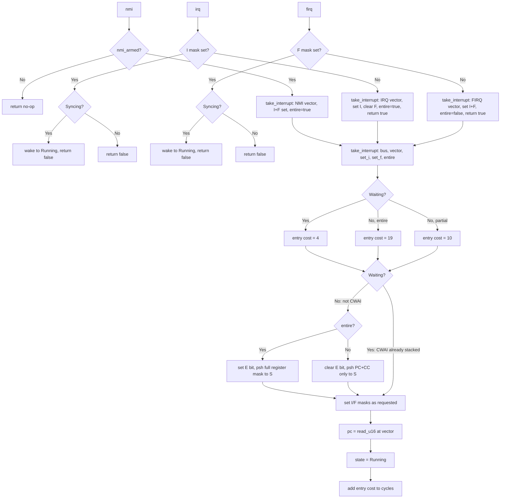

### 4. `psh()` / `pul()` — stack register-mask transfer

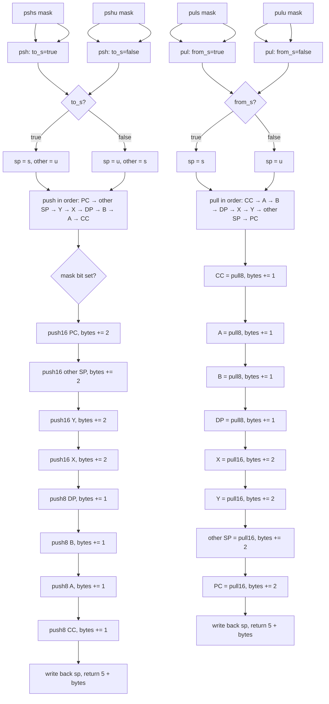

### 5. `branch_taken()` — branch condition evaluation

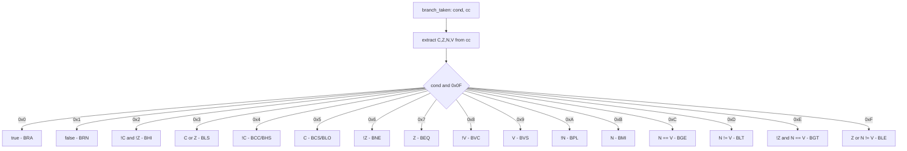

---

## Sequence Diagrams

### 1. CPU Emulation Loop

Sequence of the caller (e.g. coco-core) driving the CPU:

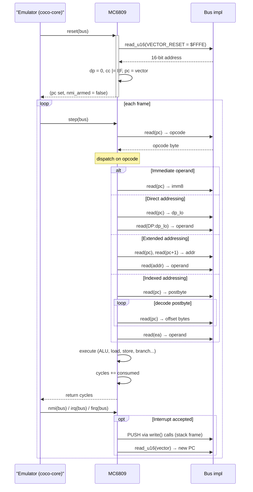

### 2. JSR/BSR → RTS Subroutine Call

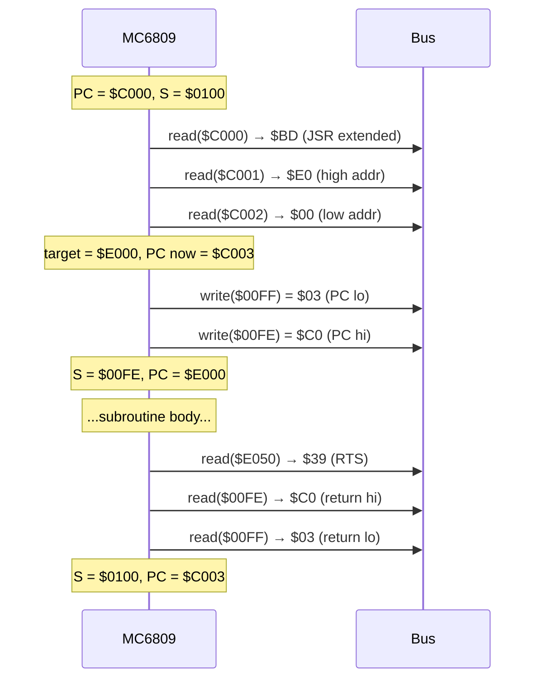

### 3. Interrupt Handling (IRQ)

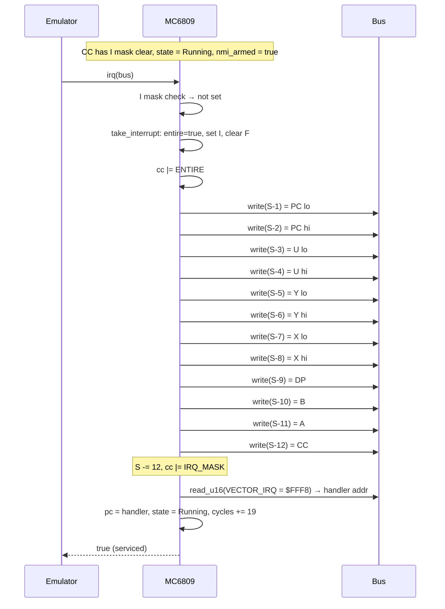

### 4. FIRQ — Fast Interrupt (partial frame)

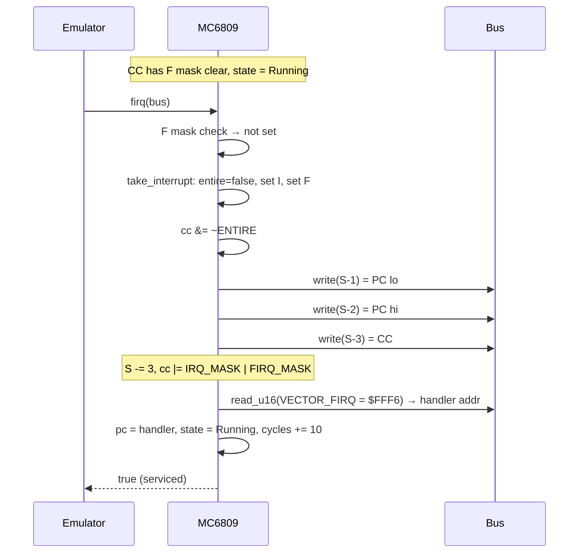

### 5. CWAI → Interrupt (combined stack+hlt)

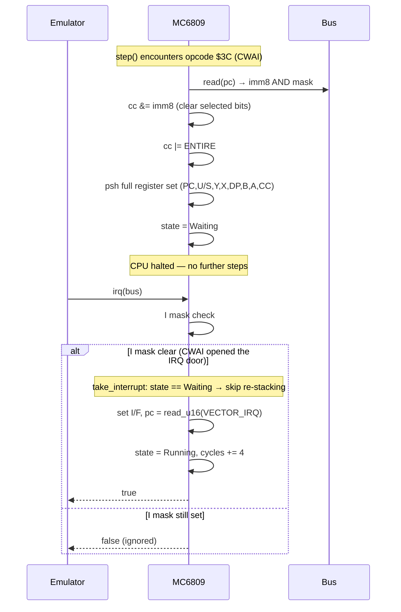

### 6. SYNC → Interrupt Wake

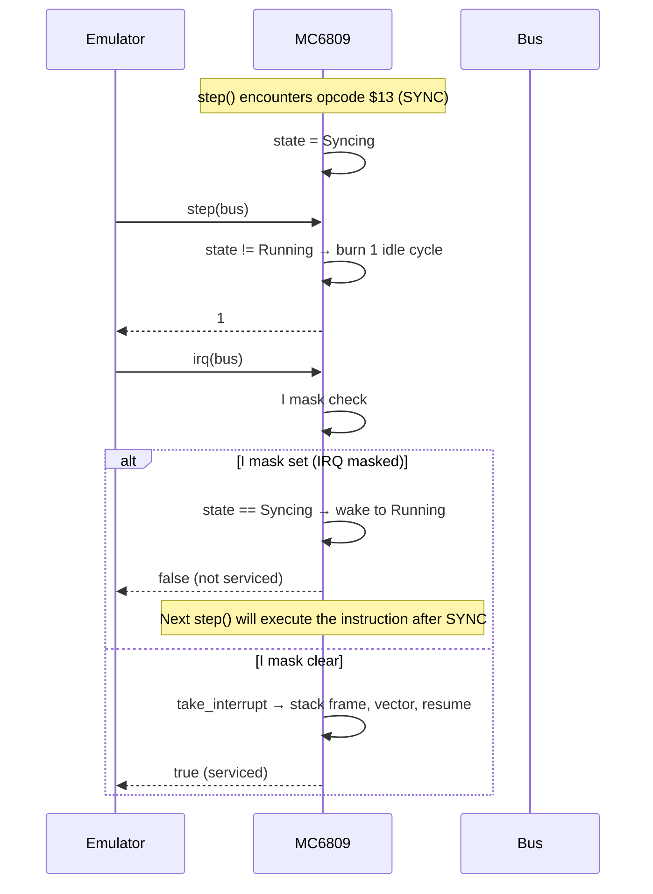

### 7. TFR / EXG Register Transfer

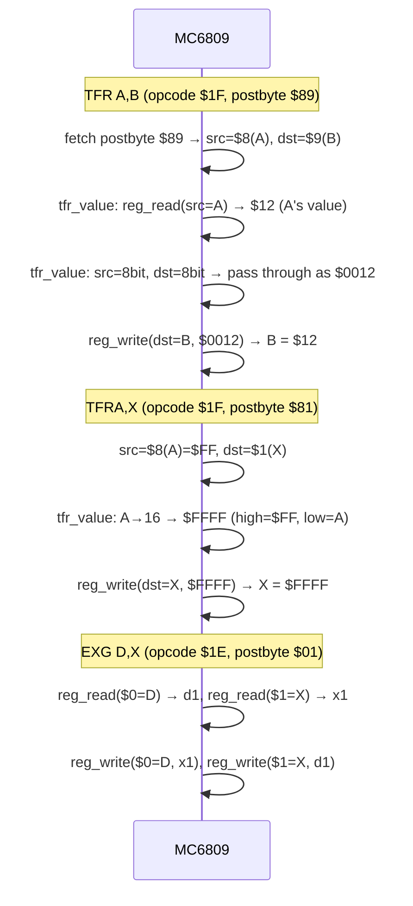
