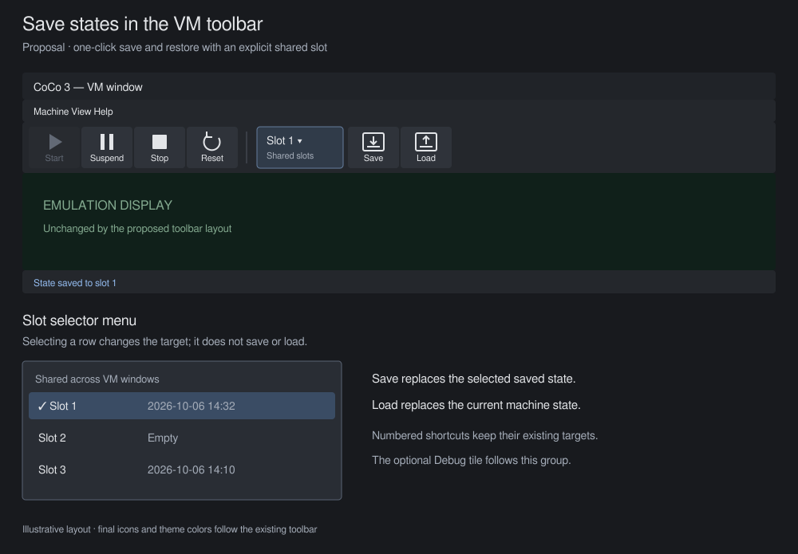
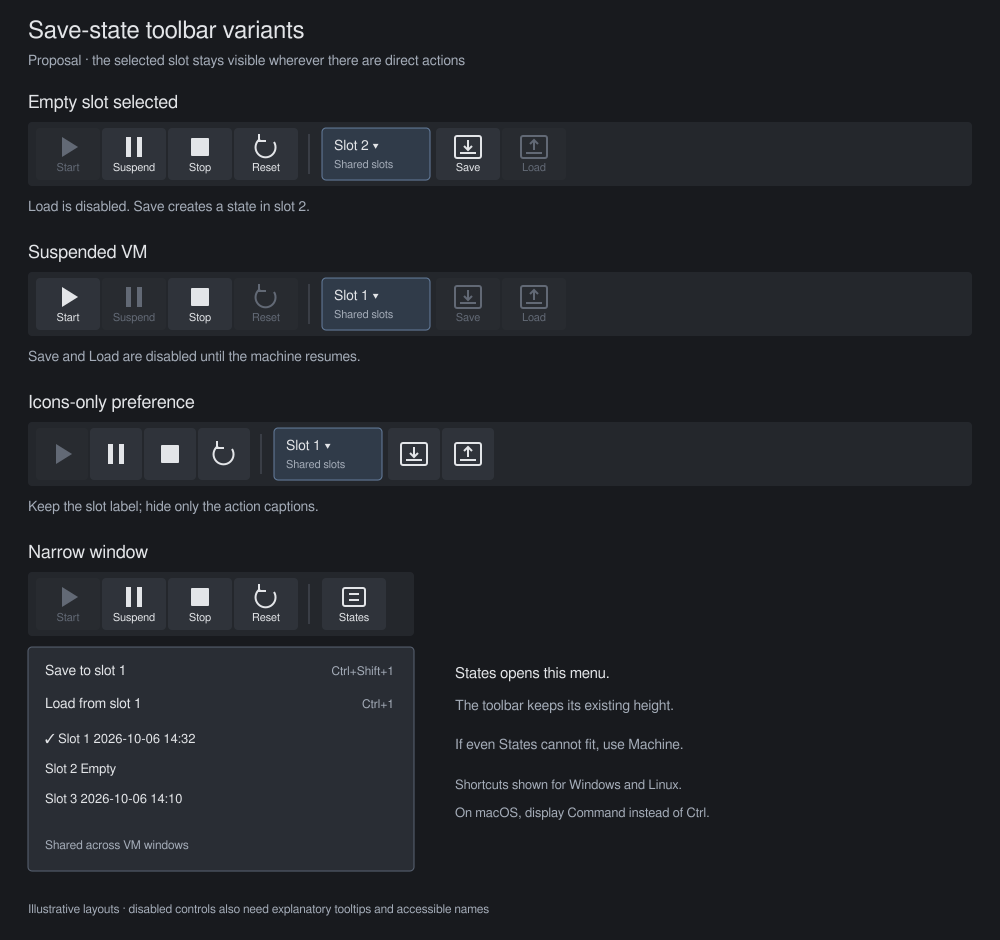

# Propose toolbar controls for save states

Status: design proposal for review. The mockups are illustrative SVGs, not
screenshots. This change adds no application behavior.

## Recommendation

Add a save-state group to each VM window's toolbar, after **Reset** and before
the optional **Debug** tile. Show a **Slot 1** selector followed by **Save** and
**Load** tiles. This gives repeated saves and restores a single-click action
while keeping the destination visible. Use the existing three quick-state slots.

The slot selector is part of the group, separated from the transport controls.
Its second line reads **Shared slots** because the slots belong to the
application, not an individual VM. The menu shows all three slots with their
last-modified times or **Empty**. Selecting a row only changes the target.

Use the existing toolbar tile sizes and caption style. **Save** and **Load**
use distinct snapshot-style icons with opposite arrows; the outlines in the
mockup illustrate the idea. Check the final glyphs in the bundled font before
implementation, or draw them with the existing UI primitives. Both controls
need accessible names that include the selected slot, such as **Quick save to
slot 1** and **Quick load from slot 1**.

## Interaction contract

The following behavior is proposed, rather than implemented:

| Situation | Proposed behavior |
| --- | --- |
| Open a VM window | Select slot 1. Keep the selection local to this window and do not persist it across launches. |
| Choose a slot | Update the selector, action tooltips, and Load availability. Do not save or load. Empty slots remain selectable. |
| Click Save | Save to the selected slot without a file dialog. Replace an occupied slot, matching existing Quick Save behavior. |
| Click Load | Restore the selected slot without a confirmation dialog, matching existing Quick Load behavior. This replaces the current machine state. |
| Selected slot is empty | Disable Load. Keep Save available. Load's disabled tooltip says **Slot 1 is empty. Save a state first.** |
| VM is suspended | Disable Save and Load. Their disabled tooltips say **Resume the machine to save or load a state.** Keep the selected slot readable. |
| VM is paused in the debugger | Allow Save and Load, as the existing quick-state actions do. |
| A slot operation succeeds | Show **State saved to slot 1** or **State loaded from slot 1** through the existing four-second status toast. Append any existing restore warnings to the load message. Refresh slot metadata. |
| A slot operation fails | Show the existing error dialog. Do not show success or change selection to a slot addressed by another control. |
| Another window changes a slot | Refresh occupancy and timestamps before presenting the menu or executing an action. Loading must still handle missing or invalid files. |

For an occupied slot, Save's tooltip reads **Save to shared slot 1. Replaces
the saved state.** Load's tooltip reads **Load shared slot 1. Replaces the
current machine state.** Append the timestamp when available and the
platform-formatted keyboard shortcut. Missing metadata must not be described
as an empty slot unless the file is absent; use **Timestamp unavailable**
when the file exists but its modification time cannot be read.

Keep the existing numbered shortcuts: Command+Shift+1 through 3 save on macOS,
and Command+1 through 3 load. Other platforms use Ctrl. These shortcuts keep
addressing their numbered slots regardless of the toolbar selection. A
successful numbered shortcut or Machine-menu quick action also selects that
slot in the originating window. A failed operation leaves selection unchanged.
File-dialog saves and loads do not change the selected quick slot.

Direct loading can discard unsaved progress. The recommendation retains the
existing one-action behavior, with explicit destination labels and tooltips.
It does not add an undo state or an overwrite confirmation. That tradeoff needs
review before implementation. Snapshots reference external media: restoring
a state does not roll back disk image writes.

## Compact and disabled states

In icons-only mode, hide the Save and Load captions, but retain the textual
slot selector. Tooltips and accessible names still identify both actions and
their slot. Use disabled styling and text explanations, not color alone, to
indicate unavailable actions.

If the full group does not fit alongside the transport controls and optional
Debug tile, collapse it to **States**. Its menu starts with **Save to slot 1**
and **Load from slot 1**, followed by the three selectable slot rows and the
**Shared across VM windows** explanation. Use the same enablement rules and
shortcuts as the expanded group. If even the collapsed group cannot fit,
omit it and retain access through the existing **Machine** menu.

Determine fit from available width and the existing tile dimensions, including
separators and panel margins. Do not introduce a hard-coded viewport breakpoint
or wrap the toolbar: its height participates in the framebuffer sizing math.
Keep menu navigation and tile activation available from the keyboard, including
when captions are hidden. Narrow-layout testing must include the optional
Debug tile and increased UI scale.

## Alternative: two slot menus

Two tiles labeled **Quick Save** and **Quick Load**, each opening the existing
three-slot menu, would avoid selected-slot state. This is the smaller design
and exposes timestamps before every action, but each operation needs two
clicks. It also repeats the slot lists in two menus. Choose this alternative
if the main aim is discoverability rather than repeated one-click actions.

The recommended group makes the one-click behavior explicit. Six buttons,
one pair for every slot, consume too much toolbar space. A single unlabeled
save-state icon makes the distinction between saving and restoring unclear.

## Existing behavior and implementation boundaries

The relevant source files establish these constraints:

| Source | Existing behavior |
| --- | --- |
| [VM toolbar](../crates/coco-egui/src/chrome/toolbar.rs) | Start, Suspend, Stop, Reset, and optional Debug tiles. |
| [Toolbar widgets](../crates/coco-egui/src/widgets.rs) | Shared tile presentation and icons-only handling. |
| [Save-state UI](../crates/coco-egui/src/save_state.rs) | Three global slots, timestamps, numbered shortcuts, Machine-menu actions, and four-second toasts. |
| [Save path](../crates/coco-egui/src/save_state/save.rs) | Flushes media, writes a snapshot, and reports errors, including pending DriveWire host I/O. |
| [Restore path](../crates/coco-egui/src/save_state/restore.rs) | Validates and restores state, reconnects host resources, and reports warnings. |
| [VM windows](../crates/coco-egui/src/manager/vm_windows.rs) | Per-window lifecycle and sizing. No minimum VM width is declared here. |

Implementation would reuse `quick_save` and `quick_load`, including their
errors, restore warnings, and window-title refresh. Their return values would
need to report success explicitly to support selection changes and slot-specific
feedback. Do not infer success from toast text. Reuse `QUICK_SLOTS`, shortcut
formatters, tile dimensions, and the existing toast duration.

The manager toolbar operates on selected machines, so this proposal targets
VM windows only. Per-VM slot storage, named snapshots, previews, autosave,
undo-load, and snapshot-format changes are outside this proposal. The existing
Machine-menu file dialogs remain the route for named state files.

## Acceptance checks for a later implementation

Before shipping the controls, verify the following behavior:

- Save to an empty slot, advance emulation, and restore it from the toolbar.
- Select each slot and confirm that Save and Load target the visible number.
- Use numbered shortcuts and menu actions to verify selection changes only
  after success. Verify file-dialog actions leave the selection unchanged.
- Check empty, occupied, unreadable, deleted, and corrupt slot files. Preserve
  existing restore warnings and failure handling.
- Save from a second VM window and confirm that the first window refreshes
  shared-slot metadata without suggesting that the slot belongs to it.
- Check suspended and debugger-paused VMs, light and dark themes, icons-only
  mode, keyboard navigation, UI scaling, and narrow widths with Debug enabled.

Chapters 15 and 16 describe frontend and save-state behavior. They need no
behavioral update for this proposal-only change. Update their affected sections
in the implementation PR if the design is accepted.
